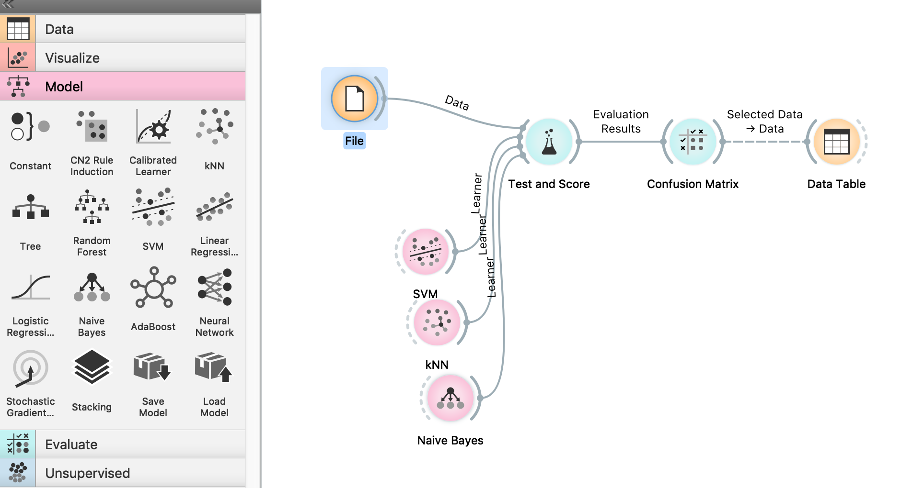

# Lab 7 - Machine Learning with Orange and Scikit-learn

## Requirements

* [Anaconda Python Distribution](https://www.anaconda.com/products/individual).

[Orange](https://orangedatamining.com/) and [scikit-learn](https://scikit-learn.org/stable/) come with the Anaconda Python Distribution. You can launch Orange using [Anaconda Navigator](https://docs.anaconda.com/anaconda/navigator/index.html).

## Goal 1 - Introduction to Machine Learning workflow using Orange 3

### Classification

In this section, you will use the Iris dataset that already comes with Orange. You can load the dataset using the "File" widget. 

Create from scratch a classification pipeline with the following widgets:

* File
* Test and Score
* Confusion Matrix
* Data Table

They should be connected sequentially.

Then connect several classifiers to the Test and Score Module:

* SVM
* kNN
* Naive Bayes

The structure should be similar to:



#### Test the best features

Use the widget select columns (from Data panel in Orange). Place it between the File widget and the Test and Score widget.   
Identify what is the single best feature to classify the Iris dataset.

#### Decision Tree

Recreate the classifier with only a Decision Tree classifier. Use the Decision Tree visualizer (in the Orange panels: Visualize -> Tree Viewer)

### Regression

Recreate the pipeline to use the *housing* dataset. A description of the dataset is available [here](https://www.cs.toronto.edu/~delve/data/boston/bostonDetail.html).

1. Start by using PCA widget (in Unsupervized panel) to make a dimensionality reduction to 3 principal components.
2. Use linear regression widget to create a model for the data.
3. Evaluate in the Test and Score widget.

## Goal 2 - Introduction to Scikit Learn. Train, evaluate and deploy a machine learning model

To install the Scikit in your RPI:

* `sudo apt-get install python3-scipy`
* `sudo pip3 install -U scikit-learn`

In this goal you will use Scikit Learn (also known as sklearn). Scikit-learn is one of the most popular machine learning libraries.
You will train a model to classify digits. You can use the Spyder IDE to create your script. 

1. Load the digits dataset (datasets.load_digits() [dataset description](https://scikit-learn.org/stable/auto_examples/datasets/plot_digits_last_image.html)), and separate into training and testing datasets.
2. instantiate Naive Bayes and kNN classifiers:
   
   ```Python
   from sklearn.naive_bayes import GaussianNB
   from sklearn.neighbors import KNeighborsClassifier
   ```

clf_NB = GaussianNB()
clf_kNN = KNeighborsClassifier()

```
3. Then use the methods in each classifier to fit to the training set and predict the test set

* `clf.fit()` (to train)
* `predict()` (to test the trained classifier)

4. Evaluate the performance of the classifier using the following functions:

* `metrics.classification_report`
* `metrics.confusion_matrix`

Use this [example](https://scikit-learn.org/stable/auto_examples/classification/plot_digits_classification.html#sphx-glr-auto-examples-classification-plot-digits-classification-py) in case of need.

5. Save the model and create a separate script which loads the model and predicts the test set
After training a scikit-learn model, it is desirable to have a way to persist the model for future use without having to retrain. Read the [documentation](https://scikit-learn.org/stable/modules/model_persistence.html) on how to persist a scikit-learn model.
```
